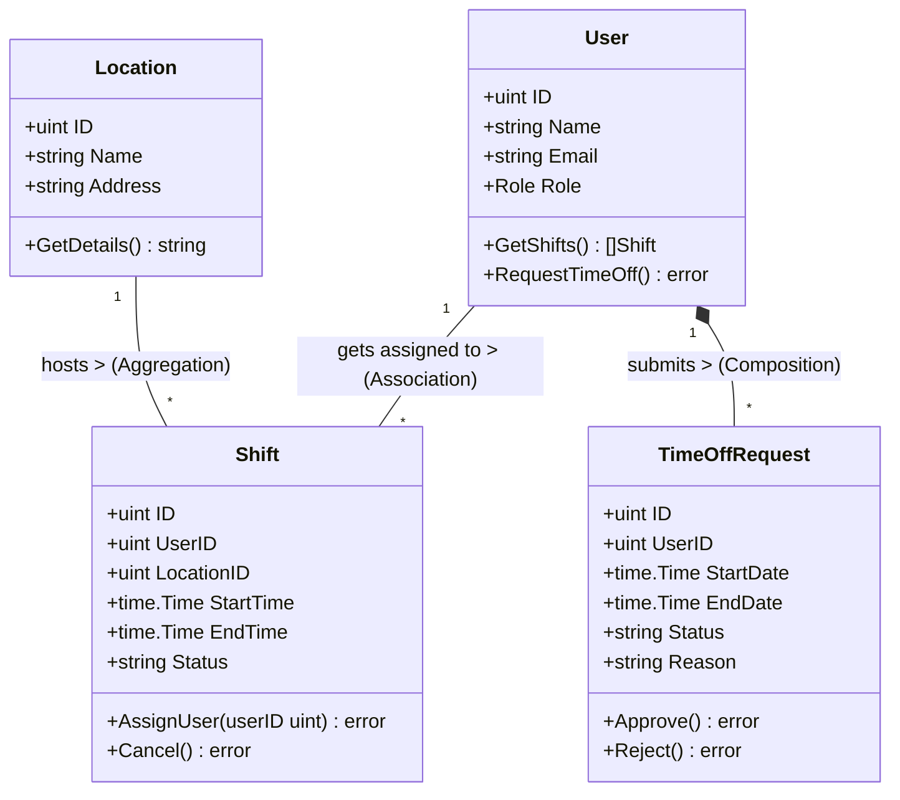

# Tài Liệu Thiết Kế Chi Tiết (Detail Design)
**Dự án:** Quản lý ca làm việc (Shift Management System)
**Ngôn ngữ triển khai:** Golang

---

## 1. Phân tích thực thể và hành vi (Noun Extraction - Bước 10 & 11)

Dựa trên kịch bản nghiệp vụ của hệ thống Quản lý ca làm việc, dưới đây là danh sách trích xuất các Danh từ thành các Lớp/Thực thể (Entity), Hành vi (Methods) và Phân loại (Stereotype). Trong Golang, các Entity này được biểu diễn dưới dạng `struct`.

| Tên Lớp (Entity/Struct) | Stereotype | Thuộc tính (Attributes) | Phương thức / Hành vi (Methods) |
| :--- | :--- | :--- | :--- |
| **User** (Nhân viên) | Entity | `ID`, `Name`, `Email`, `Role` | `GetShifts()`, `RequestTimeOff()` |
| **Location** (Địa điểm) | Entity | `ID`, `Name`, `Address` | `GetDetails()` |
| **Shift** (Ca làm việc) | Entity | `ID`, `StartTime`, `EndTime`, `Status`| `AssignUser()`, `Cancel()` |
| **TimeOffRequest** | Entity | `ID`, `StartDate`, `EndDate`, `Status`, `Reason` | `Approve()`, `Reject()` |
| **ShiftService** | Service | `shiftRepo`, `userRepo` | `ScheduleShift()`, `GetShiftsByUser()` |
| **UserService** | Service | `userRepo` | `RegisterUser()`, `Authenticate()` |
| **TimeOffService** | Service | `timeOffRepo` | `SubmitRequest()`, `ReviewRequest()` |
| **UserRepository** | Repository | | `Save()`, `FindById()`, `FindAll()` |
| **ShiftRepository** | Repository | | `Save()`, `FindByUserId()`, `Delete()` |

---

## 2. Thiết kế mối quan hệ và Sơ đồ UML (Class Diagram - Bước 12 & 13)

Sơ đồ UML dưới đây minh họa kiến trúc các Entity và mối quan hệ giữa chúng trong hệ thống:



**Giải thích các mối quan hệ (Relationships):**
- **User & Shift ($1..*$):** Mối quan hệ Liên kết (Association) thông thường thông qua `UserID` (Khóa ngoại). Một nhân viên có thể được phân công nhiều ca làm.
- **Location & Shift ($1..*$):** Mối quan hệ Tập hợp (Aggregation) thông qua `LocationID`. Một địa điểm có thể chứa nhiều ca làm việc, nhưng địa điểm vẫn tồn tại độc lập ngay cả khi không có ca làm nào (hoặc ca làm bị xóa).
- **User & TimeOffRequest ($1..*$):** Mối quan hệ Thành phần (Composition). Một nhân viên có thể gửi nhiều yêu cầu nghỉ phép. Nếu một nhân viên (User) bị xóa khỏi hệ thống, các yêu cầu nghỉ phép (TimeOffRequest) của họ cũng sẽ bị xóa bỏ theo.

---

## 3. Thiết lập cấu trúc dự án (Layered Architecture - Bước 14)

Để đảm bảo mã nguồn dễ bảo trì, mở rộng và tuân thủ chặt chẽ Kiến trúc Phân tầng (Layered Architecture) tương tự như hệ sinh thái Java Maven, dự án Golang này được tổ chức theo cấu trúc thư mục sau:

```text
shift-management/
├── go.mod               (Quản lý các thư viện, tương đương pom.xml)
├── go.sum
├── .gitignore
├── docs/                (Chứa các tài liệu thiết kế)
│   └── DESIGN.md        (Tài liệu thiết kế chi tiết này)
├── domain/              (Tầng Domain - Chứa các Entity Structs: User, Shift, Location...)
├── repository/          (Tầng Data Access - Chứa Interface và triển khai kết nối Database)
├── service/             (Tầng Business Logic - Xử lý các quy tắc nghiệp vụ cốt lõi)
├── ui/                  (Tầng Presentation - Chứa API Controllers hoặc giao diện HTTP/CLI)
├── config/              (Thiết lập cấu hình Database, biến môi trường...)
└── util/                (Các hàm công cụ bổ trợ, tiện ích)
```

**Ý nghĩa của việc phân tầng:**
Việc chia nhỏ hệ thống thành các tầng `domain`, `repository`, `service` và `ui` giúp phân tách rành mạch trách nhiệm của từng phần (Separation of Concerns). `Service` không cần biết dữ liệu được lưu dưới DB như thế nào (đã có `Repository` lo), và `UI` chỉ cần gọi đến `Service` thay vì thao tác trực tiếp với Database. Cấu trúc này hoàn toàn đáp ứng được các tiêu chuẩn khắt khe về Software Design Pattern.

---

## 4. Quản trị Rủi ro & Dự báo Năng suất (Mở rộng ERP)

Để quản trị một hệ thống nhân sự lớn (Enterprise Level), phần mềm không chỉ lên lịch mà còn phải đóng vai trò như một AI dự báo sớm rủi ro vận hành.

### 4.1. Tính năng Dự đoán Nguy cơ Nghỉ việc (Attrition Prediction)
Để làm điều này, bạn cần thu thập các "tín hiệu" (features) từ lịch sử hoạt động của nhân viên để đưa vào mô hình học máy (Machine Learning).

**Các chỉ số dự báo (Input Features):**
- **Tần suất nghỉ phép:** Nhân viên đột ngột nghỉ phép nhiều hơn bình thường hoặc nghỉ vào những ngày quan trọng.
- **Khoảng cách di chuyển:** Quãng đường từ nhà đến công ty quá xa (dựa trên dữ liệu hồ sơ).
- **Cường độ làm việc:** Số giờ tăng ca (OT) quá cao trong thời gian dài dẫn đến kiệt sức (Burnout).
- **Lương và Thưởng:** So sánh mức lương hiện tại với mặt bằng chung hoặc thời gian chưa được tăng lương.
- **Biến động tâm lý:** Nếu có hệ thống đánh giá tâm trạng sau ca làm việc (Survey nhanh), đây là nguồn dữ liệu quý giá.

**Thuật toán gợi ý:**
- **Random Forest hoặc XGBoost:** Rất hiệu quả cho các dữ liệu dạng bảng (tabular data) để phân loại nhân viên thành 2 nhóm: "Có nguy cơ nghỉ" hoặc "Ổn định".
- **Phân tích sống sót (Survival Analysis):** Dự đoán khoảng thời gian còn lại một nhân viên sẽ gắn bó với công ty.

### 4.2. Danh sách Nhân viên Thay thế (Backup/Succession Planning)
Để luôn có sẵn người thay thế đủ trình độ, bạn cần xây dựng một hệ thống Ma trận kỹ năng (Skill Matrix) chặt chẽ.

**Cơ chế hoạt động:**
- **Định nghĩa kỹ năng (Competency Mapping):** Mỗi vị trí trong ca sản xuất (ví dụ: vận hành máy mài, kiểm định chất lượng) cần những kỹ năng cụ thể và cấp độ (Level 1-5).
- **Gợi ý thông minh (Smart Suggestion):** Khi hệ thống phát hiện một người ở vị trí A có nguy cơ nghỉ, nó sẽ tự động quét toàn bộ cơ sở dữ liệu để lọc ra những người có:
  - Cùng hoặc thừa kỹ năng cho vị trí A.
  - Đang ở các vị trí ít quan trọng hơn hoặc đang trong ca nghỉ.
  - Có khoảng cách địa lý gần nhà máy để có thể điều động gấp.

**Hệ thống Đào tạo chéo (Cross-training):**
- Ứng dụng sẽ gợi ý lịch làm việc sao cho nhân viên mới được làm cùng ca với "chuyên gia" để học hỏi, từ đó làm dày thêm danh sách nhân sự dự phòng.

---

## 5. Từ vựng Kỹ thuật bổ sung
- **Employee Attrition:** Tỷ lệ nhân viên nghỉ việc.
- **Burnout Score:** Chỉ số đo lường mức độ kiệt sức của nhân viên.
- **Predictive Analytics:** Phân tích dự báo (sử dụng dữ liệu quá khứ để đoán tương lai).
- **Redundancy Planning:** Lập kế hoạch dự phòng nhân sự để đảm bảo hệ thống không có "điểm yếu duy nhất" (Single Point of Failure).
- **On-call list:** Danh sách nhân viên sẵn sàng điều động khi có ca trực trống đột xuất.
