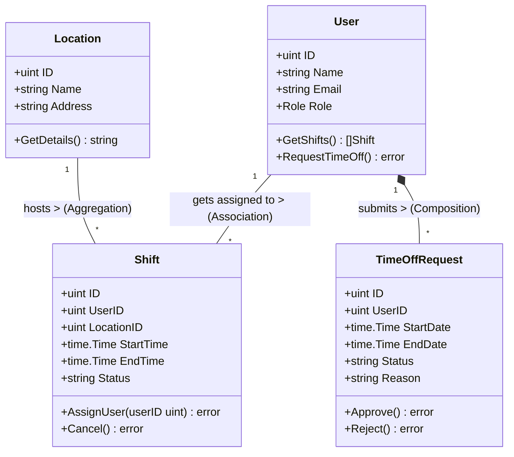

# Tài Liệu Thiết Kế Chi Tiết (Detail Design)
**Dự án:** Quản lý ca làm việc (Shift Management System)
**Ngôn ngữ triển khai:** Golang

---

## 1. Phân tích thực thể và hành vi (Noun Extraction - Bước 10 & 11)

Dựa trên kịch bản nghiệp vụ của hệ thống Quản lý ca làm việc, dưới đây là danh sách trích xuất các Danh từ thành các Lớp/Thực thể (Entity), Hành vi (Methods) và Phân loại (Stereotype). Trong Golang, các Entity này được biểu diễn dưới dạng `struct`.

| Tên Lớp (Entity/Struct) | Stereotype | Thuộc tính (Attributes) | Phương thức / Hành vi (Methods) |
| :--- | :--- | :--- | :--- |
| **User** (Nhân viên) | Entity | `ID`, `Name`, `Email`, `Role` | `GetShifts()`, `RequestTimeOff()` |
| **Location** (Địa điểm) | Entity | `ID`, `Name`, `Address` | `GetDetails()` |
| **Shift** (Ca làm việc) | Entity | `ID`, `StartTime`, `EndTime`, `Status`| `AssignUser()`, `Cancel()` |
| **TimeOffRequest** | Entity | `ID`, `StartDate`, `EndDate`, `Status`, `Reason` | `Approve()`, `Reject()` |
| **ShiftService** | Service | `shiftRepo`, `userRepo` | `ScheduleShift()`, `GetShiftsByUser()` |
| **UserService** | Service | `userRepo` | `RegisterUser()`, `Authenticate()` |
| **TimeOffService** | Service | `timeOffRepo` | `SubmitRequest()`, `ReviewRequest()` |
| **UserRepository** | Repository | | `Save()`, `FindById()`, `FindAll()` |
| **ShiftRepository** | Repository | | `Save()`, `FindByUserId()`, `Delete()` |

---

## 2. Thiết kế mối quan hệ và Sơ đồ UML (Class Diagram - Bước 12 & 13)

Sơ đồ UML dưới đây minh họa kiến trúc các Entity và mối quan hệ giữa chúng trong hệ thống:



**Giải thích các mối quan hệ (Relationships):**
- **User & Shift ($1..*$):** Mối quan hệ Liên kết (Association) thông thường thông qua `UserID` (Khóa ngoại). Một nhân viên có thể được phân công nhiều ca làm.
- **Location & Shift ($1..*$):** Mối quan hệ Tập hợp (Aggregation) thông qua `LocationID`. Một địa điểm có thể chứa nhiều ca làm việc, nhưng địa điểm vẫn tồn tại độc lập ngay cả khi không có ca làm nào (hoặc ca làm bị xóa).
- **User & TimeOffRequest ($1..*$):** Mối quan hệ Thành phần (Composition). Một nhân viên có thể gửi nhiều yêu cầu nghỉ phép. Nếu một nhân viên (User) bị xóa khỏi hệ thống, các yêu cầu nghỉ phép (TimeOffRequest) của họ cũng sẽ bị xóa bỏ theo.

---

## 3. Thiết lập cấu trúc dự án (Layered Architecture - Bước 14)

Để đảm bảo mã nguồn dễ bảo trì, mở rộng và tuân thủ chặt chẽ Kiến trúc Phân tầng (Layered Architecture) tương tự như hệ sinh thái Java Maven, dự án Golang này được tổ chức theo cấu trúc thư mục sau:

```text
shift-management/
├── go.mod               (Quản lý các thư viện, tương đương pom.xml)
├── go.sum
├── .gitignore
├── docs/                (Chứa các tài liệu thiết kế)
│   └── DESIGN.md        (Tài liệu thiết kế chi tiết này)
├── domain/              (Tầng Domain - Chứa các Entity Structs: User, Shift, Location...)
├── repository/          (Tầng Data Access - Chứa Interface và triển khai kết nối Database)
├── service/             (Tầng Business Logic - Xử lý các quy tắc nghiệp vụ cốt lõi)
├── ui/                  (Tầng Presentation - Chứa API Controllers hoặc giao diện HTTP/CLI)
├── config/              (Thiết lập cấu hình Database, biến môi trường...)
└── util/                (Các hàm công cụ bổ trợ, tiện ích)
```

**Ý nghĩa của việc phân tầng:**
Việc chia nhỏ hệ thống thành các tầng `domain`, `repository`, `service` và `ui` giúp phân tách rành mạch trách nhiệm của từng phần (Separation of Concerns). `Service` không cần biết dữ liệu được lưu dưới DB như thế nào (đã có `Repository` lo), và `UI` chỉ cần gọi đến `Service` thay vì thao tác trực tiếp với Database. Cấu trúc này hoàn toàn đáp ứng được các tiêu chuẩn khắt khe về Software Design Pattern.
