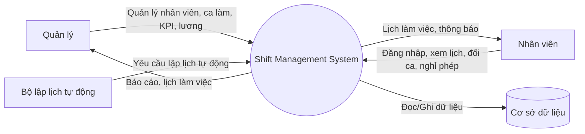
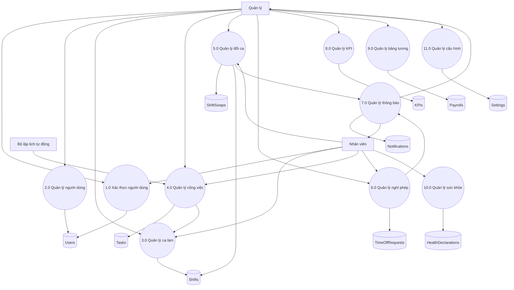

# PHÂN TÍCH HỆ THỐNG BẰNG DATA FLOW DIAGRAM (DFD)

## 1. Giới thiệu

Trong quá trình phát triển phần mềm, việc phân tích hệ thống giúp xác định cách dữ liệu được xử lý và luân chuyển giữa các thành phần của hệ thống. Một trong những công cụ phổ biến được sử dụng trong phương pháp phân tích có cấu trúc là Data Flow Diagram (DFD).

Đối với dự án **Shift Management System**, DFD được sử dụng để mô tả luồng dữ liệu giữa người dùng, các chức năng nghiệp vụ và cơ sở dữ liệu. Việc xây dựng DFD giúp nhóm hiểu rõ hơn về cách hệ thống hoạt động trước khi chuyển sang giai đoạn thiết kế hướng đối tượng và triển khai.

## 2. Tổng quan hệ thống

Shift Management System là hệ thống hỗ trợ quản lý ca làm việc cho nhân viên trong doanh nghiệp hoặc tổ chức.

Các chức năng chính của hệ thống bao gồm:

* Quản lý người dùng
* Quản lý ca làm việc
* Quản lý công việc
* Quản lý đổi ca
* Quản lý nghỉ phép
* Quản lý KPI
* Quản lý bảng lương
* Quản lý thông báo
* Quản lý khai báo sức khỏe
* Quản lý cấu hình hệ thống

Hệ thống được xây dựng bằng ngôn ngữ Go và sử dụng các thành phần:

* Gin Framework
* GORM
* SQLite
* JWT Authentication

## 3. Các tác nhân ngoài

Tác nhân ngoài là những đối tượng tương tác với hệ thống nhưng không thuộc phạm vi xử lý bên trong hệ thống.

### 3.1 Quản lý (Manager)

Quản lý có các chức năng:

* Quản lý nhân viên
* Quản lý ca làm việc
* Quản lý công việc
* Duyệt yêu cầu đổi ca
* Duyệt yêu cầu nghỉ phép
* Theo dõi KPI
* Quản lý bảng lương

### 3.2 Nhân viên (Employee)

Nhân viên có các chức năng:

* Đăng nhập hệ thống
* Xem lịch làm việc
* Xem công việc được giao
* Gửi yêu cầu đổi ca
* Gửi yêu cầu nghỉ phép
* Nhận thông báo từ hệ thống

### 3.3 Bộ lập lịch tự động (System Scheduler)

Đây là thành phần hoạt động tự động nhằm:

* Kiểm tra các công việc chưa được phân công
* Tạo lịch làm việc tự động
* Cập nhật ca làm việc

### 3.4 Cơ sở dữ liệu

Cơ sở dữ liệu có nhiệm vụ:

* Lưu trữ dữ liệu người dùng
* Lưu trữ dữ liệu ca làm
* Lưu trữ dữ liệu công việc
* Lưu trữ dữ liệu KPI
* Lưu trữ dữ liệu bảng lương
* Lưu trữ dữ liệu thông báo

## 4. Các tiến trình chính của hệ thống

### 4.1 Xác thực người dùng

Tiến trình này xử lý:

* Đăng nhập
* Xác thực tài khoản
* Phân quyền người dùng

### 4.2 Quản lý người dùng

Tiến trình này xử lý:

* Thêm người dùng
* Cập nhật thông tin người dùng
* Xóa người dùng
* Tìm kiếm người dùng

### 4.3 Quản lý ca làm việc

Tiến trình này xử lý:

* Tạo ca làm việc
* Cập nhật ca làm việc
* Phân công ca làm việc
* Xem lịch làm việc

### 4.4 Quản lý công việc

Tiến trình này xử lý:

* Tạo công việc
* Giao công việc
* Cập nhật trạng thái công việc

### 4.5 Quản lý đổi ca

Tiến trình này xử lý:

* Gửi yêu cầu đổi ca
* Duyệt yêu cầu đổi ca
* Từ chối yêu cầu đổi ca

### 4.6 Quản lý nghỉ phép

Tiến trình này xử lý:

* Gửi yêu cầu nghỉ phép
* Duyệt nghỉ phép
* Từ chối nghỉ phép

### 4.7 Quản lý thông báo

Tiến trình này xử lý:

* Tạo thông báo
* Gửi thông báo
* Lưu lịch sử thông báo

### 4.8 Quản lý KPI

Tiến trình này xử lý:

* Đánh giá hiệu suất nhân viên
* Tính KPI
* Lưu KPI

### 4.9 Quản lý bảng lương

Tiến trình này xử lý:

* Tính lương
* Lưu thông tin lương
* Xuất báo cáo lương

### 4.10 Quản lý khai báo sức khỏe

Tiến trình này xử lý:

* Gửi khai báo sức khỏe
* Lưu thông tin sức khỏe

### 4.11 Quản lý cấu hình hệ thống

Tiến trình này xử lý:

* Cập nhật cấu hình
* Thiết lập tham số hệ thống

## 5. Kho dữ liệu (Data Store)

Dựa trên các thực thể trong hệ thống, các kho dữ liệu chính bao gồm:

| Mã  | Kho dữ liệu        |
| --- | ------------------ |
| D1  | Users              |
| D2  | Shifts             |
| D3  | Tasks              |
| D4  | ShiftSwaps         |
| D5  | TimeOffRequests    |
| D6  | Notifications      |
| D7  | KPIs               |
| D8  | Payrolls           |
| D9  | HealthDeclarations |
| D10 | Settings           |

---

## 6. DFD mức ngữ cảnh (Context Diagram)

DFD mức ngữ cảnh mô tả toàn bộ hệ thống như một tiến trình duy nhất.

## 7. DFD mức 1 (Level 1 DFD)

Từ DFD mức ngữ cảnh, hệ thống Shift Management System được phân rã thành các tiến trình nhỏ hơn. Mỗi tiến trình xử lý một nhóm chức năng riêng và tương tác với các kho dữ liệu tương ứng.

### 7.1 Mô tả các luồng dữ liệu chính

| Luồng dữ liệu | Mô tả |
|---|---|
| Quản lý/Nhân viên → Xác thực người dùng | Người dùng gửi thông tin đăng nhập vào hệ thống |
| Xác thực người dùng → Users | Hệ thống kiểm tra tài khoản trong kho dữ liệu Users |
| Quản lý → Quản lý người dùng | Quản lý thêm, sửa, xóa hoặc xem thông tin nhân viên |
| Quản lý/Nhân viên → Quản lý ca làm | Quản lý tạo ca, nhân viên xem ca được phân công |
| Bộ lập lịch tự động → Quản lý công việc | Hệ thống tự động kiểm tra công việc để tạo lịch |
| Quản lý công việc → Quản lý ca làm | Công việc có thể được dùng để tạo hoặc cập nhật ca làm |
| Nhân viên → Quản lý đổi ca | Nhân viên gửi yêu cầu đổi ca |
| Quản lý → Quản lý đổi ca | Quản lý duyệt hoặc từ chối yêu cầu đổi ca |
| Quản lý đổi ca → Thông báo | Sau khi xử lý đổi ca, hệ thống tạo thông báo |
| Nhân viên → Quản lý nghỉ phép | Nhân viên gửi yêu cầu nghỉ phép |
| Quản lý → Quản lý nghỉ phép | Quản lý duyệt hoặc từ chối yêu cầu nghỉ phép |
| Quản lý nghỉ phép → Thông báo | Sau khi xử lý nghỉ phép, hệ thống gửi thông báo |
| Quản lý → Quản lý KPI | Quản lý xem hoặc cập nhật KPI nhân viên |
| Quản lý → Quản lý bảng lương | Quản lý xem hoặc cập nhật thông tin lương |
| Nhân viên → Quản lý sức khỏe | Nhân viên gửi khai báo sức khỏe |
| Quản lý → Quản lý cấu hình | Quản lý cập nhật các thiết lập của hệ thống |

### 7.2 Nhận xét

DFD mức 1 cho thấy hệ thống được chia thành nhiều tiến trình xử lý độc lập. Các tiến trình quan trọng nhất là quản lý người dùng, quản lý ca làm, quản lý công việc, đổi ca, nghỉ phép và thông báo.

Các kho dữ liệu như Users, Shifts, Tasks, ShiftSwaps và Notifications đóng vai trò trung tâm vì được nhiều tiến trình sử dụng.

## 8. Nhận xét

Qua quá trình phân tích DFD có thể thấy:

* Hệ thống có hai nhóm người dùng chính là Quản lý và Nhân viên.
* Hầu hết các chức năng đều liên quan đến dữ liệu người dùng và ca làm việc.
* Các chức năng đổi ca, nghỉ phép và thông báo có mối liên hệ chặt chẽ với nhau.
* Bộ lập lịch tự động giúp giảm công việc thủ công cho người quản lý.

## 9. Kết luận

Việc xây dựng DFD giúp nhóm hiểu rõ các luồng dữ liệu trong hệ thống Shift Management System. Đây là cơ sở quan trọng để tiếp tục thực hiện thiết kế có cấu trúc, thiết kế hướng đối tượng và xây dựng UML trong các tuần tiếp theo.
